<p align="center">
  
</p>

<p align="center">
  <a href="https://instagram.com/hey_marro"></a>
  <a href="https://x.com/marro_land"></a>
  <a href="https://github.com/maurolando?tab=repositories"></a>
</p>

---

### 🌵 Sobre mí

```txt
maurolando@desierto:~$ whoami

  🎓  Licenciado en Análisis de Sistemas — UNICAN / FACITEC
  🧰  Backend en Java + Spring, frontend en Angular
  🌍  Paraguay
```

Me gusta el código que se entiende sin comentarios, los coches que suenan bien
y las noches con playlist larga.

---

### 🛠️ Stack

**Backend**


**Frontend**


**Datos**


**Herramientas & diseño**


---

### 🌙 Fuera del código

<table width="100%">
  <tr>
    <td width="50%" align="center">
      <a href="https://open.spotify.com/user/76084awtdhrn36jen8aa66voy">
        
      </a>
      <br><br>
      <a href="https://open.spotify.com/user/76084awtdhrn36jen8aa66voy"><b>Lo que suena mientras programo</b></a>
      <br>
      <sub>La playlist es parte del entorno de desarrollo.</sub>
    </td>
    <td width="50%" align="center">
      <a href="https://steamcommunity.com/profiles/76561199379247794/">
        
      </a>
      <br><br>
      <a href="https://steamcommunity.com/profiles/76561199379247794/"><b>elmarroh</b></a>
      <br>
      <sub>Una partida más.</sub>
    </td>
  </tr>
</table>

---

### 📊 Stats

<p align="center">
  
</p>

---

<p align="center">
  <sub>🌵 Un cactus no pide mucho: paciencia y buena luz. El código tampoco.</sub><br>
  
</p>
